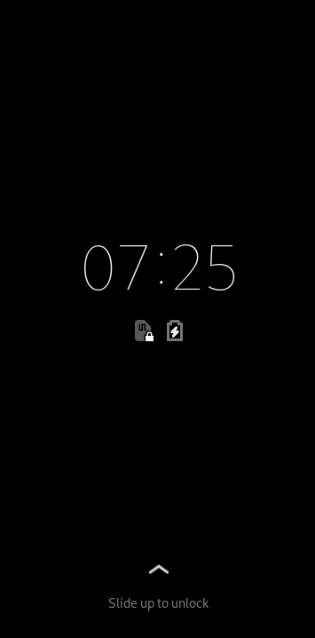

# Phosh

a pure wayland shell for mobile devices like Purism's Librem 5.

## License

phosh is licensed under the GPLv3+.

## Getting the source

```sh
    git clone https://gitlab.gnome.org/World/Phosh/phosh
    cd phosh
```

The master branch has the current development version.

## Dependencies
On a Debian based system run

```sh
    sudo apt-get -y install build-essential
    sudo apt-get -y build-dep .
```

For an explicit list of dependencies check the `Build-Depends` entry in the
[debian/control][] file.

If your distro doesn't ship [libhandy](https://gitlab.gnome.org/GNOME/libhandy)
you need to build that from source. More details are in the [gitlab-ci.yml][]
file.

## Building

We use the meson (and thereby Ninja) build system for phosh.  The quickest
way to get going is to do the following:

    meson . _build
    ninja -C _build
    ninja -C _build install

# Testing

To run the tests run

    ninja -C _build test

For details see the *.gitlab-ci.yml* file.

There are some thorough tests not run during CI which can e.g. be run via

    gtester -m thorough  _build/tests/test-idle-manager

## Running
### Running from the source tree
When running from the source tree start the compositor *[phoc][]*.
Then start *phosh* using:

    _build/run -U

or in one command:

    ../phoc/_build/run -E '_build/run -U' -C ./data/phoc.ini

When running nested it's recommended to skip the `gnome-session` setup:

    SKIP_GNOME_SESSION=1 ../phoc/_build/run -E '_build/run -U' -C ./data/phoc.ini


This will make sure the needed gsettings schema is found. The '-U' option makes
sure the shell is not locked on startup so you can test with arbitrary
passwords.
This works on hardware as well as nested on other desktop environments. The
result should look something like this:



### Running from the Debian packages
If you're running a display manager like GDM or LightDM you can select the
`Phosh` session from the display managers menu. If you want run without a
display manager but nevertheless start phosh at system boot there's a systemd
unit file in */lib/systemd/system/phosh* which is disabled by default:

    systemctl enable phosh
    systemctl start phosh

This runs *phosh* as the user with user id 1000 (which needs to exist). If you
don't have that user and don't want to create one you can make systemd
run *phosh* as any user by using an override file:

    $ cat /etc/systemd/system/phosh.service.d/override.conf
    [Service]
    User=<your_user>

All of the above use the `/usr/bin/phosh` script to start compositor and shell
under the hood so if you just want to start phosh from the system console once
invoke that script directly.

# Translations
This is handled via GNOMEs infra, see
<https://wiki.gnome.org/TranslationProject> and
<https://l10n.gnome.org/module/phosh/>.

# Getting in Touch
* Issue tracker: https://gitlab.gnome.org/World/Phosh/phosh/issues
* Mailing list: https://lists.community.puri.sm/listinfo/librem-5-dev
* Matrix: https://im.puri.sm/#/room/#phosh:talk.puri.sm
* XMPP: phosh@conference.sigxcpu.org

For details see the [developer documentation](https://developer.puri.sm/Contact.html).

### Development Documentation

API documentation is at https://world.pages.gitlab.gnome.org/Phosh/phosh

[gitlab-ci.yml]: https://gitlab.gnome.org/World/Phosh/phosh/blob/master/.gitlab-ci.yml
[debian/control]: https://gitlab.gnome.org/World/Phosh/phosh/blob/master/debian/control
[phoc]: https://gitlab.gnome.org/World/Phosh/phoc
