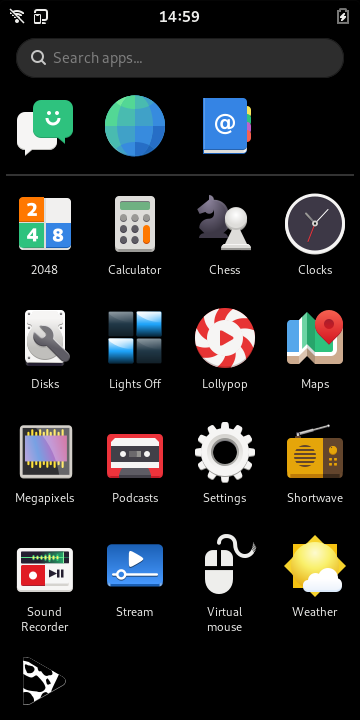

# Phosh

a pure wayland shell for mobile devices like Purism's Librem 5.

## License

phosh is licensed under the GPL-3.0-or-later licence.

## Getting the source

```sh
git clone https://gitlab.gnome.org/World/Phosh/phosh
cd phosh
git submodule update --init --recursive
```

The [main][] branch has the current development version.

## Dependencies
On a Debian based system run

```sh
sudo apt-get -y install build-essential
sudo apt-get -y build-dep .
```

For an explicit list of dependencies check the `Build-Depends` entry in the
[debian/control][] file.

## Building

We use the meson (and thereby Ninja) build system for phosh.  The quickest
way to get going is to do the following:

```sh
meson setup _build
meson compile -C _build
```

# Testing

To run the tests run

```sh
xvfb-run meson test --no-suite screenshots -C _build
```

For details see the [.gitlab-ci.yml][] file.

## Running
### Running from the source tree
When running from the source tree start the compositor *[phoc][]*.
Then start *phosh* using:

```sh
_build/run
```

or (if you built *phoc* from source in *../phoc*) in one command:

```sh
../phoc/_build/run -C ./data/phoc.ini -E _build/run
```

This will make sure the needed gsettings schema is found. Note that there's no
need to install any files outside the source tree.

The result should look something like this:



### Running from the Debian packages
If you're running a display manager like GDM or LightDM you can select the
`Phosh` session from the display managers menu. If you want run without a
display manager but nevertheless start phosh at system boot there's a systemd
unit file in */lib/systemd/system/phosh* which is disabled by default:

```sh
systemctl enable phosh
systemctl start phosh
```

This runs *phosh* as the user with user id 1000 (which needs to exist). If you
don't have that user and don't want to create one you can make systemd
run *phosh* as any user by using an override file:

```sh
cat <<EOF > /etc/systemd/system/phosh.service.d/override.conf
[Service]
User=<your_user>
EOF
```

All of the above use the `/usr/bin/phosh` script to start compositor and shell
under the hood so if you just want to start phosh from the system console once
invoke that script directly.

# Translations
This is handled via GNOMEs infra, see
<https://wiki.gnome.org/TranslationProject> and
<https://l10n.gnome.org/module/phosh/>.

# Getting in Touch
* Issue tracker: https://gitlab.gnome.org/World/Phosh/phosh/issues
* Matrix: https://im.puri.sm/#/room/#phosh:talk.puri.sm

### Development Documentation

API documentation is at https://world.pages.gitlab.gnome.org/Phosh/phosh

[main]: https://gitlab.gnome.org/World/Phosh/phosh/-/tree/main
[.gitlab-ci.yml]: https://gitlab.gnome.org/World/Phosh/phosh/-/blob/main/.gitlab-ci.yml
[debian/control]: https://gitlab.gnome.org/World/Phosh/phosh/-/blob/main/debian/control
[phoc]: https://gitlab.gnome.org/World/Phosh/phoc
